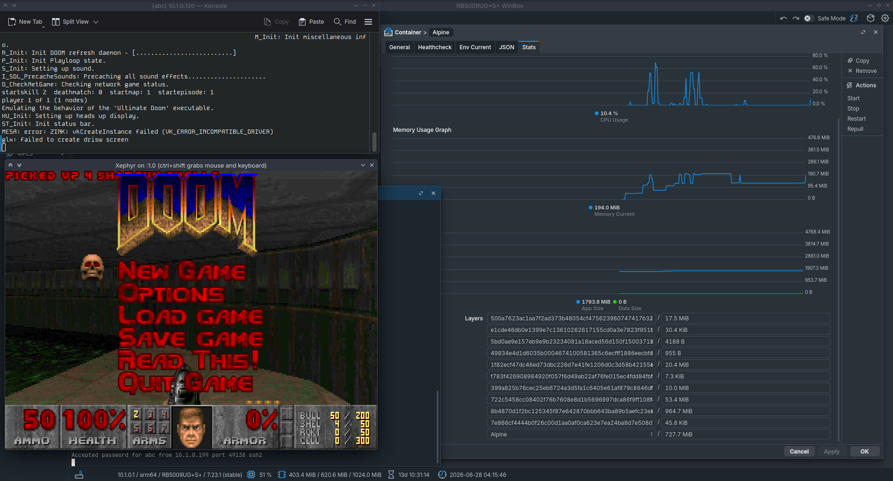

# RB5009-Doom

Run **Chocolate Doom** on a MikroTik RB5009 in a container, accessible via KasmVNC (browser) or X11 forwarding with Xephyr.



---

## 1. Container Setup on the RB5009

It's best to use **external storage** for the container root directory.

```bash
/container/config set registry-url=https://ghcr.io
/container add name=Doom remote-image=linuxserver/baseimage-kasmvnc:alpine320 root-dir=your_root_dir interface=veth1 logging=yes
```

## 2. Start and Enter the Container

```bash
/container start Doom
/container shell Doom
```

## 3. Initial Configuration (inside container)

The default user is `abc`. Adjust permissions and set a password:

```bash
chown -R abc:abc /root
sudo passwd abc
```

Disconnect with `Ctrl+D` / `^D`.

## 4. Restart the Container

```bash
/container stop Doom
/container start Doom
```

At this point KasmVNC is accessible at `http://<veth1-ip>:3000`.

## 5. Install SSH and Xauth

```bash
/container start Doom

# Inside the container
sudo apk add openssh xauth

# Prep xauth
touch /config/.Xauthority
export XAUTHORITY=/config/.Xauthority

# Configure sshd
sudo ssh-keygen -A

# Enable X11 forwarding
sudo sed -i 's/#X11Forwarding.*/X11Forwarding yes/' /etc/ssh/sshd_config
grep -q '^X11Forwarding yes' /etc/ssh/sshd_config || echo "X11Forwarding yes" | sudo tee -a /etc/ssh/sshd_config

# Start the daemon
sudo /usr/sbin/sshd
```

## 6. Restart the Container

```bash
/container stop Doom
/container start Doom
```

Continue in the terminal window or via SSH to the container — your choice.

## 7. Build Chocolate Doom

Install build tools and clone the source:

```bash
sudo apk add build-base cmake git sdl2-dev sdl2_mixer-dev sdl2_net-dev libpng-dev libsamplerate-dev

cd /tmp
git clone --depth 1 https://github.com/chocolate-doom/chocolate-doom.git
cd chocolate-doom
cmake -B build
cmake --build build -j"$(nproc)" --target chocolate-doom
```

## 8. Install Xephyr (Host PC)

On Fedora (adjust for your distro):

```bash
dnf install Xephyr
```

---

## Playing Doom

1. **Start the container** in WinBox/WebUI on the RB5009.
   - Open the container terminal as root and run: `/usr/sbin/sshd -D -e &`
   - Note the `veth1` IP address.

2. **On your host PC**, open a terminal and run:

   ```bash
   Xephyr :1 -screen 800x600 &
   DISPLAY=:1 ssh -Y -R /tmp/pulse.sock:$XDG_RUNTIME_DIR/pulse/native abc@{containerIp}
   ```

   You should now have an 800×600 Xephyr window and an SSH session into the container.

3. **Start Doom:**

   ```bash
   cd /tmp/chocolate-doom/build/src
   PULSE_SERVER=unix:/tmp/pulse.sock ./chocolate-doom -iwad {wadFile}
   ```

---

## Other Games Tested

The following games have been tested and work on the same container setup:

| Game | Engine |
|---|---|
| Descent | [dxx-rebirth](https://github.com/dxx-rebirth/dxx-rebirth) |
| Diablo 1 | [devilutionX](https://github.com/diasurgical/devilutionx) |
| Duke Nukem 3D | [eDuke32](https://www.eduke32.com/) |
| Quake | [tyrquake](https://github.com/mikrosk/tyrquake) |
| Super Mario 64 | [sm64ex](https://github.com/sm64pc/sm64ex) |
| Unreal Tournament | [469e ARM64 patch](https://github.com/OldUnreal/UnrealTournamentPatches/releases) |

---

## Acknowledgments

Original inspiration and guidance from the MikroTik forum thread:  
[Running GUI apps in container](https://forum.mikrotik.com/t/running-gui-apps-in-container/180211)
